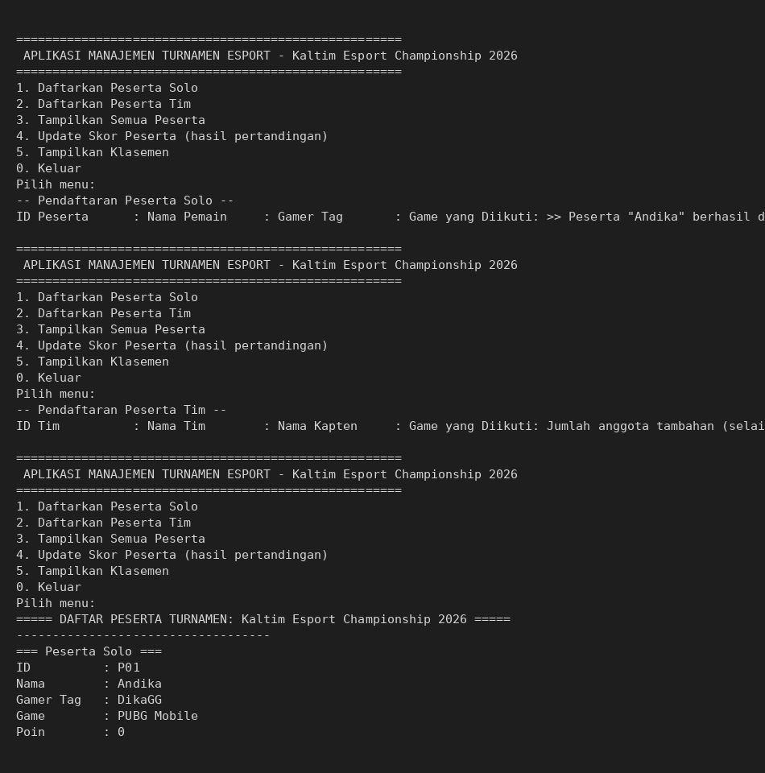

# Aplikasi Manajemen Turnamen Esport (CLI - Java OOP)

## 1. Identitas Mahasiswa
- **Nama** : Muhammad Dylan Al Furqon
- **NIM**  : 2509116038

## 2. Deskripsi Studi Kasus
Aplikasi ini adalah program berbasis **Command Line Interface (CLI)** yang mensimulasikan
sistem **Manajemen Turnamen Esport**. Program memungkinkan panitia turnamen untuk:

1. Mendaftarkan peserta yang bertanding secara **perorangan (solo)**, misalnya pemain PUBG Mobile atau Tekken.
2. Mendaftarkan peserta yang bertanding secara **beregu (tim)**, misalnya tim Mobile Legends atau Valorant, lengkap dengan kapten dan daftar anggotanya.
3. Menampilkan seluruh peserta yang telah terdaftar beserta detail masing-masing.
4. Memperbarui (update) skor/poin peserta berdasarkan hasil pertandingan.
5. Menampilkan **klasemen akhir** turnamen, diurutkan dari poin tertinggi ke terendah.

Studi kasus ini dipilih karena secara alami memiliki dua jenis peserta yang berbeda
struktur datanya (solo vs tim) namun memiliki banyak kesamaan perilaku (memiliki ID,
nama, game yang diikuti, dan poin) — sehingga sangat relevan untuk menerapkan konsep
**inheritance**.

## 3. Hierarki Class (Class Diagram Sederhana)

```
                    Peserta (abstract)
                    -----------------
                    - idPeserta : String
                    - nama : String
                    - gameYangDiikuti : String
                    - poin : int
                    -----------------
                    + tampilkanDetail() : String   [abstract]
                    + infoRingkas() : String
                    + tambahPoin(int)
                           △
                           |  extends
              -----------------------------
              |                           |
        PesertaSolo                  PesertaTim
        -----------------            -----------------
        - gamerTag : String          - kapten : String
        -----------------            - anggotaTim : List<String>
        + tampilkanDetail()          -----------------
        (override)                   + tambahAnggota(String)
                                      + tampilkanDetail()
                                      (override)

        Turnamen                              Main
        -----------------                     -----------------
        - namaTurnamen : String                (entry point / menu CLI)
        - daftarPeserta : List<Peserta>        menggunakan objek Turnamen
        -----------------                      untuk memproses input user
        + daftarkanPeserta(Peserta)
        + cariPesertaById(String)
        + updateSkor(String, int)
        + tampilkanSemuaPeserta()
        + tampilkanKlasemen()
```

**Relasi antar kelas:**
- `PesertaSolo` **extends** `Peserta` → *inheritance*
- `PesertaTim` **extends** `Peserta` → *inheritance*
- `Turnamen` memiliki (aggregation) banyak objek `Peserta` melalui `List<Peserta>`
- `Main` menggunakan `Turnamen` untuk menjalankan seluruh logika lewat menu CLI

## 4. Penjelasan Penerapan Inheritance

Kelas `Peserta` dibuat sebagai **superclass abstrak** yang menyimpan atribut dan
perilaku umum yang dimiliki oleh semua jenis peserta turnamen (ID, nama, game yang
diikuti, dan poin), beserta satu method abstrak `tampilkanDetail()`.

```java
public abstract class Peserta {
    private String idPeserta;
    private String nama;
    private String gameYangDiikuti;
    private int poin;
    // ...
    public abstract String tampilkanDetail();
}
```

Dua **subclass** kemudian mewarisi (`extends`) seluruh atribut dan method dari
`Peserta`, lalu menambahkan atribut khususnya masing-masing serta meng-override
method abstrak sesuai kebutuhannya:

```java
public class PesertaSolo extends Peserta {
    private String gamerTag;   // atribut tambahan khusus solo

    public PesertaSolo(String idPeserta, String nama, String gameYangDiikuti, String gamerTag) {
        super(idPeserta, nama, gameYangDiikuti);  // memanggil constructor superclass
        this.gamerTag = gamerTag;
    }

    @Override
    public String tampilkanDetail() { ... }
}
```

```java
public class PesertaTim extends Peserta {
    private String kapten;
    private List<String> anggotaTim;   // atribut tambahan khusus tim

    public PesertaTim(String idPeserta, String namaTim, String gameYangDiikuti, String kapten) {
        super(idPeserta, namaTim, gameYangDiikuti);
        this.kapten = kapten;
        this.anggotaTim = new ArrayList<>();
        this.anggotaTim.add(kapten);
    }

    @Override
    public String tampilkanDetail() { ... }
}
```

Dengan struktur ini:
- Kode untuk field `idPeserta`, `nama`, `gameYangDiikuti`, `poin`, method `tambahPoin()`,
  dan `infoRingkas()` **tidak perlu ditulis ulang** di kedua subclass — cukup diwariskan
  dari `Peserta`. Ini adalah manfaat utama inheritance: **penghematan kode (reusability)**.
- Kelas `Turnamen` menyimpan data dalam bentuk `List<Peserta>`, sehingga bisa menampung
  objek `PesertaSolo` maupun `PesertaTim` sekaligus dalam satu list yang sama. Saat method
  `p.tampilkanDetail()` dipanggil, Java akan otomatis menjalankan versi override yang sesuai
  dengan jenis objek aslinya (solo atau tim) — inilah contoh nyata **polymorphism** yang
  dibangun di atas inheritance.

Selain inheritance & polymorphism, program ini juga menerapkan **encapsulation**
(seluruh field bersifat `private` dan hanya bisa diakses lewat getter/setter) dan
**abstraction** (kelas `Peserta` bersifat abstrak dan tidak bisa diinstansiasi langsung).

## 5. Struktur Berkas

```
EsportTournamentManagement/
├── src/
│   ├── Peserta.java        # Superclass abstrak
│   ├── PesertaSolo.java    # Subclass 1 (inheritance)
│   ├── PesertaTim.java     # Subclass 2 (inheritance)
│   ├── Turnamen.java       # Kelas pengelola data peserta
│   └── Main.java           # Program utama / menu CLI
├── screenshots/
│   └── contoh_run.png
└── README.md
```

## 6. Cara Menjalankan Program

```bash
cd src
javac *.java
java Main
```

Setelah dijalankan, program akan menampilkan menu berikut:

```
1. Daftarkan Peserta Solo
2. Daftarkan Peserta Tim
3. Tampilkan Semua Peserta
4. Update Skor Peserta (hasil pertandingan)
5. Tampilkan Klasemen
0. Keluar
```

## 7. Tangkapan Layar (Screenshot) Program Berjalan



> **Catatan:** Gambar di atas hanya contoh format tampilan program. Ganti dengan
> screenshot hasil menjalankan program dari terminal/IDE masing-masing sebelum
> dikumpulkan.
